# SGILC - Sistema de Gestión de Inventario para Laboratorio de Cómputo 

**SGILC** es una solución de escritorio robusta diseñada para optimizar el control de hardware y software en entornos educativos y profesionales. Desarrollada con un enfoque en la **experiencia de usuario (UX)** y una estética dark, permite gestionar activos tecnológicos con eficiencia y estilo.

---

## ✨ Características Principales

* **Panel de Control Estético:** Interfaz moderna con tema oscuro, diseñada para una navegación intuitiva y descanso visual.
* **Gestión de Inventario Dinámica:** Control detallado de equipos mediante un sistema de tarjetas visuales con soporte para imágenes.
* **Mantenimiento Inteligente:** Seguimiento de mantenimientos preventivos y correctivos con notificaciones visuales.
* **Reportes en un Clic:** Generación de reportes detallados en formato Excel para auditorías rápidas.
* **Seguridad y Respaldo:** Sistema integrado de backups para la base de datos y gestión de roles de usuario.
* **Arquitectura Portable:** Base de datos local autogestionada que no requiere configuraciones complejas de servidor.

---

## 📸 Capturas de Pantalla

|**Login** | 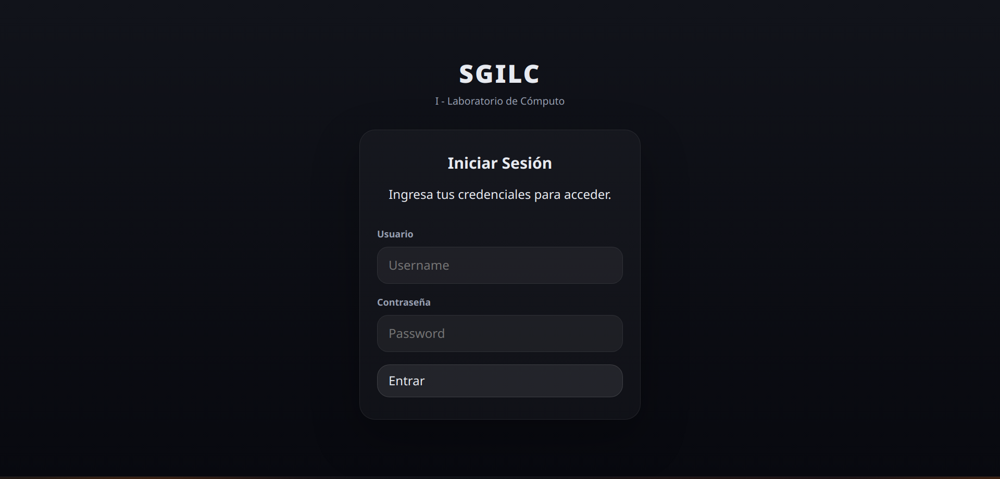 |                 
| **Dashboard** | 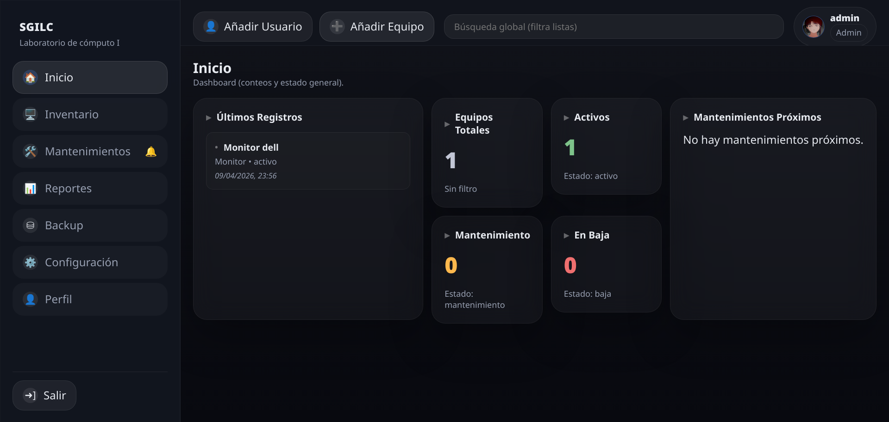 |
| **Modo Tarjetas** | 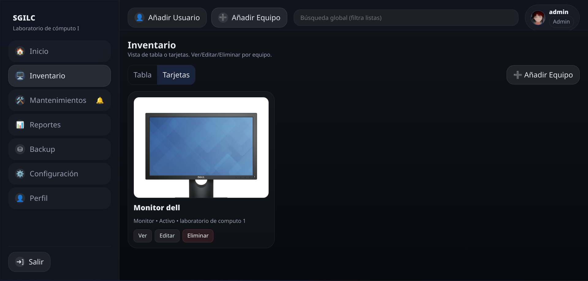 |
| **Modo Tabla** | 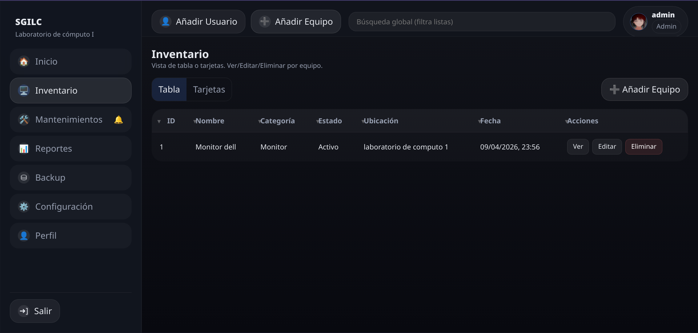 |
| **Añadir Equipo** | 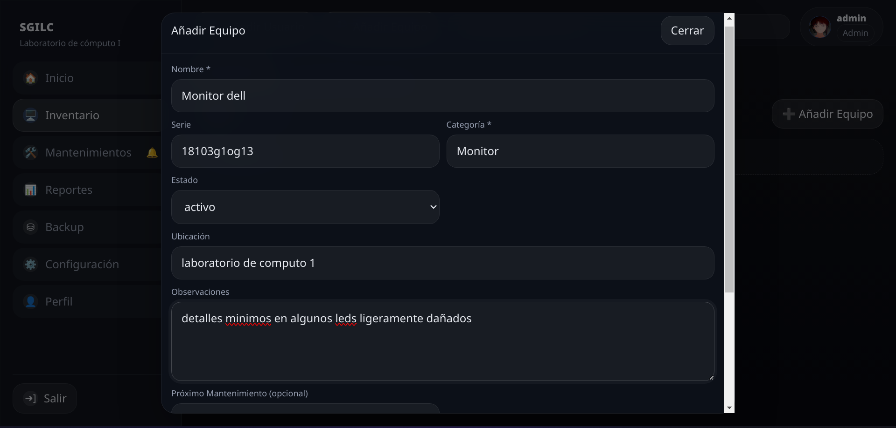 |
| **Gestión de Roles** | 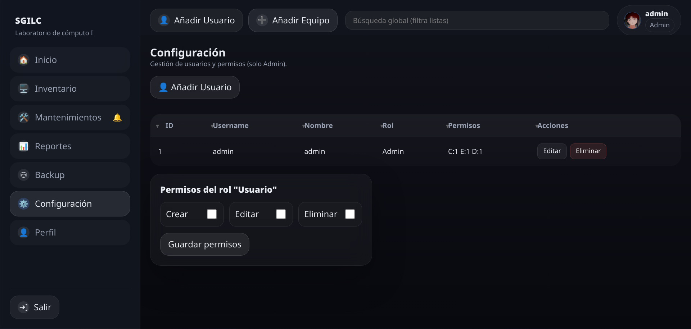 |
| **Mantenimientos** | 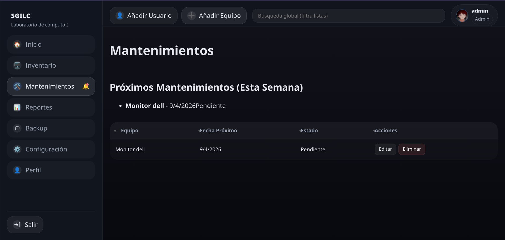 |
| **Perfil** | 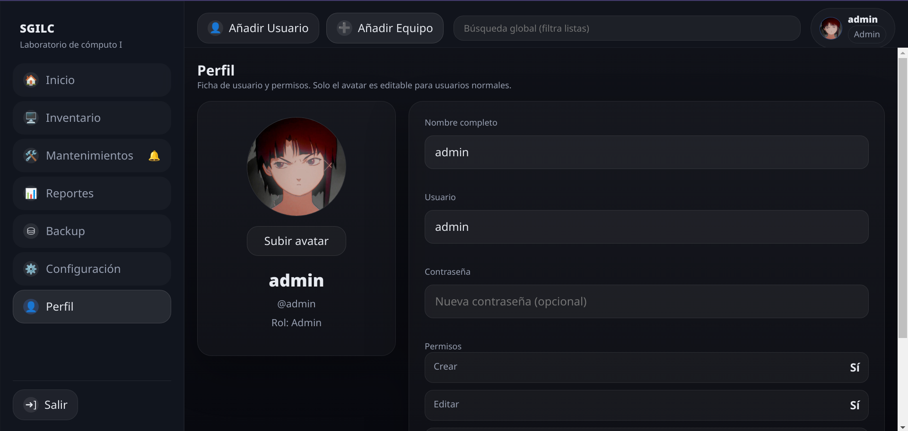 |
| **Generar Reportes** | 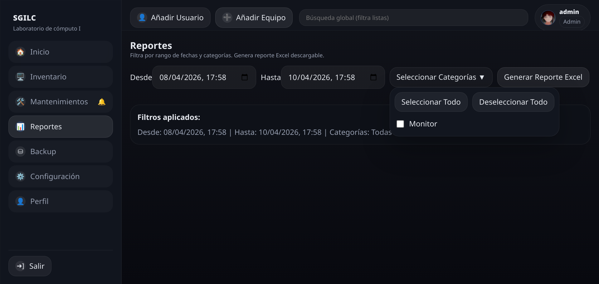 |
| **Reporte Generado** | 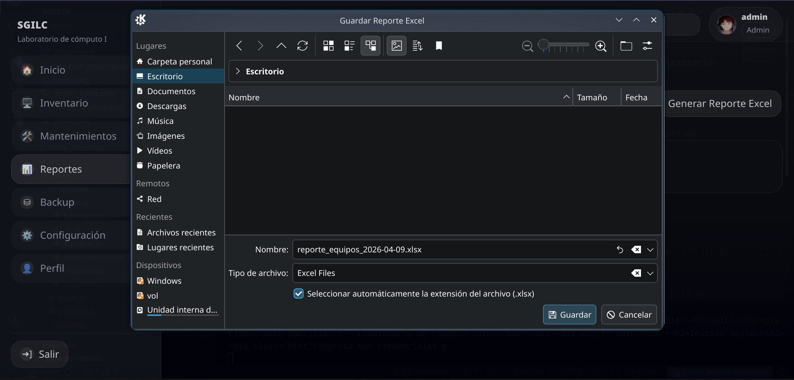 |
| **Backup DB** | 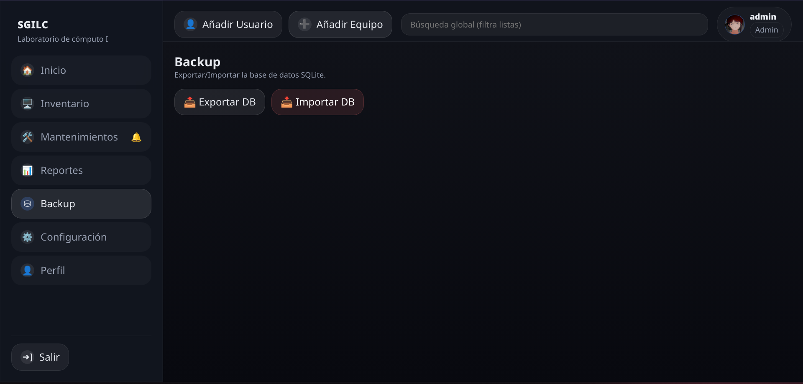 |

##  Stack Tecnológico

El proyecto utiliza tecnologías modernas de desarrollo web empaquetadas para escritorio:

* **Frontend:** HTML5, CSS3 (Custom Glassmorphism Design) y JavaScript Vanilla.
* **Runtime:** [Electron.js](https://www.electronjs.org/) (Chromium + Node.js).
* **Base de Datos:** [SQLite3](https://www.sqlite.org/) con arquitectura de persistencia local.
* **Herramientas:** Node.js para la gestión de dependencias y scripts de empaquetado.

---

##  Instalación y Desarrollo

Si deseas clonar este proyecto y ejecutarlo en tu entorno local:

1. **Clonar el repositorio:**
   ```bash
   git clone [https://github.com/VICTORONJA-MN/Lab-Inventory-Manager.git](https://github.com/VICTORONJA-MN/Lab-Inventory-Manager.git)
2. **Entrar a la carpeta:**
   
```bash
cd Lab-Inventory-Manager
```
Instalar dependencias:
```bash
npm install
```
Ejecutar en modo desarrollo:
```bash
npm start
```
## 📜 Licencia

Este proyecto está bajo la **Licencia MIT**. Esto significa que eres libre de usarlo, copiarlo, modificarlo y distribuirlo, siempre y cuando se mantenga el reconocimiento del autor original.

Consulta el archivo [LICENSE](./LICENSE) para obtener más detalles.