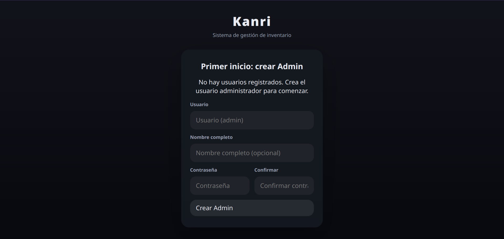
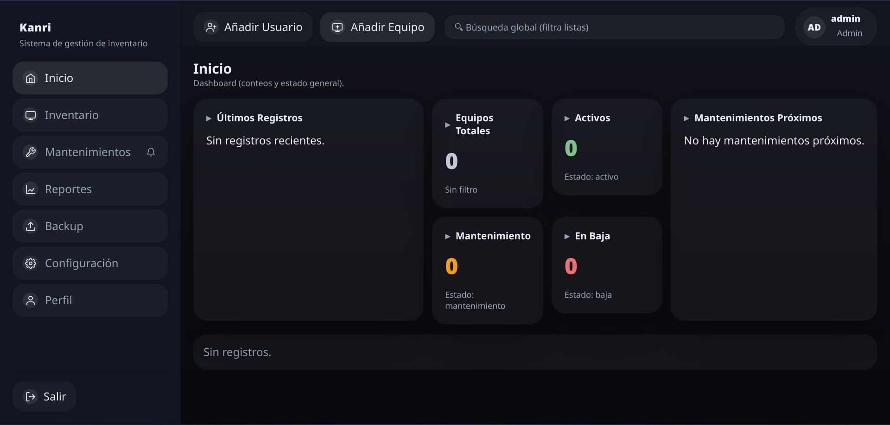
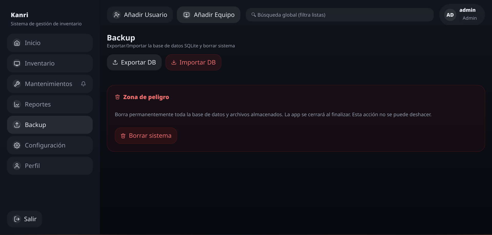
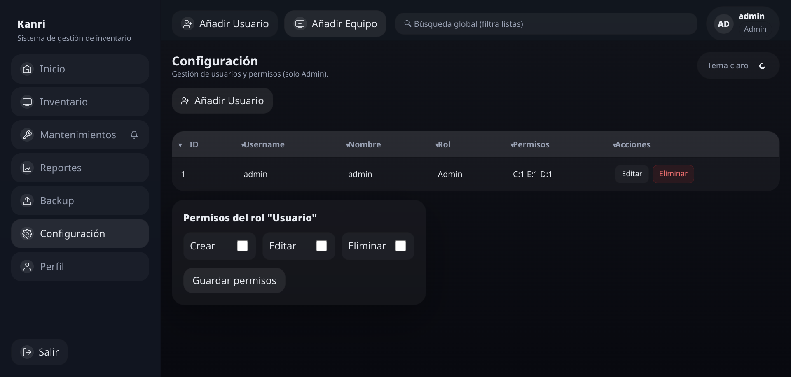

# Kanri — Sistema de Gestión de Inventario para el Laboratorio de Cómputo I

<div align="center">


**Aplicación de escritorio portable para la gestión de inventario de laboratorios de cómputo.**

[](https://www.electronjs.org/)
[](https://nodejs.org/)
[](./LICENSE)
[](https://www.microsoft.com/windows)

</div>

---

## ¿Qué es Kanri?

**Kanri** (管理, "gestión" en japonés) es una solución de escritorio desarrollada como proyecto de servicio social para digitalizar el control del inventario del Laboratorio de Cómputo I. Permite registrar equipos, dar seguimiento a mantenimientos, generar reportes en Excel y administrar usuarios, todo sin necesidad de conexión a internet ni configuración de servidores.

La aplicación es completamente portable: basta con ejecutar el `.exe` para empezar a trabajar.

---

## Características

- **Inventario visual** — Vista en tabla o tarjetas con soporte para fotografías de cada equipo.
- **Seguimiento de mantenimientos** — Registro de mantenimientos programados con alertas para los próximos 7 días.
- **Reportes en Excel** — Generación de reportes filtrados por fecha y categoría, exportables en `.xlsx`.
- **Gestión de usuarios y roles** — Dos roles (Admin y Usuario) con permisos configurables de forma granular.
- **Respaldo de datos** — Exportación e importación de la base de datos con un clic.
- **Tema claro/oscuro** — Interfaz adaptable con persistencia de preferencia.
- **Portable** — Sin instalación. Sin servidor. Sin internet.

---

## Capturas de Pantalla

| | |
|---|---|
| **Bienvenida** |  |
| **Primer inicio** |  |
| **Login** |  |
| **Dashboard** |  |
| **Inventario — Modo Tabla** |  |
| **Inventario — Modo Tarjetas** |  |
| **Añadir Equipo** |  |
| **Mantenimientos** |  |
| **Generar Reporte** |  |
| **Reporte Excel** |  |
| **Backup** |  |
| **Gestión de Usuarios y Roles** |  |
| **Perfil** |  |

---

## Stack Tecnológico

| Capa | Tecnología | Versión |
|---|---|---|
| Runtime de escritorio | Electron | 30.5.1 |
| Entorno de ejecución | Node.js | 25.x |
| Base de datos | sql.js (SQLite / WebAssembly) | 1.14.1 |
| Generación de reportes | ExcelJS | 4.4.0 |
| Hash de contraseñas | bcryptjs | 2.4.3 |
| Empaquetado | electron-builder | 24.13.3 |
| Frontend | JavaScript Vanilla (ES Modules) | — |
| Estilos | CSS puro con variables CSS | — |

---

## Instalación y Desarrollo

### Prerrequisitos

- [Node.js](https://nodejs.org/) v18 o superior
- npm (incluido con Node.js)

### Pasos

```bash
# 1. Clonar el repositorio
git clone https://github.com/VICTORONJA-MN/Kanri-Lab-Inventory-Manager.git
cd Lab-Inventory-Manager

# 2. Instalar dependencias
npm install

# 3. Ejecutar en modo desarrollo
npm run start
```

Al ejecutar por primera vez, el sistema creará automáticamente la base de datos y solicitará crear el usuario Administrador.

---

## Empaquetado

```bash
# Generar ejecutable portable para Windows (.exe)
npm run pack:win

# Generar AppImage para Linux
npm run pack:linux

# Generar sin empaquetar (para inspección)
npm run pack:dir
```

El ejecutable se genera en la carpeta `dist/`.

---

## Estructura del Proyecto

```
Kanri/
├── assets/          # Íconos, imágenes y recursos estáticos
├── src/
│   ├── main/        # Proceso principal de Electron
│   │   ├── main.js
│   │   ├── preload.js
│   │   └── services/    # Lógica de negocio (auth, equipos, db, etc.)
│   └── renderer/    # Interfaz de usuario
│       ├── index.html
│       ├── styles/
│       └── js/
├── dist/            # Salida del empaquetado
├── package.json
└── LICENSE
```

---

## Datos en Producción

Los datos del sistema se almacenan automáticamente en:

```
%APPDATA%\kanri\
    ├── database.db    # Base de datos SQLite
    └── uploads\       # Fotografías de equipos y avatares
```

Esta carpeta **no se elimina** al cerrar la aplicación. Para limpiar completamente el sistema, usar la opción **Borrar sistema** disponible en la sección Backup (requiere contraseña de Administrador).

---

## Licencia

Este proyecto está bajo la **Licencia MIT**. Eres libre de usarlo, copiarlo, modificarlo y distribuirlo siempre que se mantenga el reconocimiento del autor original.

Consulta el archivo [LICENSE](./LICENSE) para más detalles.

---

<div align="center">
  Desarrollado por <a href="https://github.com/VICTORONJA-MN">@VICTORONJA-MN</a> · Proyecto de Servicio Social
</div>